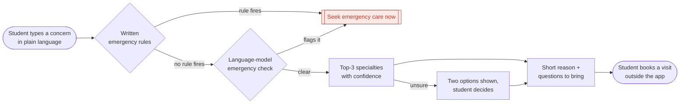

# Doc Compass

*Which doctor do I book?*

Describe a health concern in plain language. The app checks for emergency symptoms and suggests which kind of doctor to book: the top 3, with "Start with a GP" always an option. It routes; it does not diagnose. Nothing you type is stored.

CMU 24-679 Project 1



## How it works

1. **Emergency check:** 11 written rules, each citing a published warning sign (MedlinePlus, CDC), then a Qwen check for wording the rules miss. Either one firing shows "Seek emergency care now".
2. **Scrub:** removes handles, emails, phone numbers and links.
3. **Route:** BiomedBERT fine-tuned on our labelled posts; when it is unsure it shows two options.
4. **Explain:** Qwen2.5-1.5B-Instruct writes a one-sentence reason and three questions to bring. Its text is checked, and fixed wording is the fallback.

## Results

On 115 of our own test posts, scored once. Labels were drafted by an AI assistant and reviewed by the authors.

| Router | Type | Top-1 (95% CI) | Top-3 | Macro-F1 |
|---|---|---|---|---|
| Always "Start with a GP" | baseline | 40.9% (31.8–50.4) | 53.0% | 0.048 |
| TF-IDF + logistic regression | from scratch | 48.7% (39.3–58.2) | 84.3% | 0.428 |
| DistilRoBERTa | fine-tuned | 59.1% (49.6–68.2) | 91.3% | 0.523 |
| **BiomedBERT (shipped)** | fine-tuned | **60.9% (51.3–69.8)** | **90.4%** | **0.611** |

The emergency check (rules plus Qwen) misses 13 of 38 emergencies in real posts and flags 20% of ordinary ones: it catches clearly stated warning signs, it does not detect emergencies.

Details: [routing results](docs/routing-results.md) · [emergency check](docs/emergency-check-results.md) · [data card](docs/data-card.md)

## Run it

Needs Python 3.11 or newer.

```bash
python3 -m venv .venv && source .venv/bin/activate
pip install -r requirements.txt
python scripts/prepare_data.py     # downloads the posts; text stays local
python -m doccompass.app --llm     # the app at http://127.0.0.1:7860, with Qwen (about 3 GB the first time)
pytest
```

The routers must be trained first; the commands are in [docs/routing-results.md](docs/routing-results.md#reproduce). Or run the hosted version: `notebooks/doc_compass_app.ipynb` opens the app in Colab (T4 GPU) and prints a public link and QR code.

## Repo

| Path | What it holds |
|---|---|
| `doccompass/` | the app: rules, routers, pipeline, Gradio interface |
| `scripts/` | data prep, training, evaluation, publishing |
| `tools/annotate.py` | the labelling tool (see `LABELLING.md`) |
| `docs/` | results, data card, label set, system figures |
| `doc-compass-plan.md` | the full plan |

## Data rules

- Never commit post text: labelled data is shared as post ids and labels only.
- Keep public and synthetic data apart from our labels.
- Keep API keys and tokens out of the repo.
