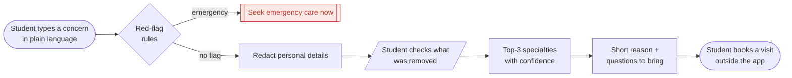

# Doc Compass

*Which doctor do I book?*

Describe a health concern in plain language. The app removes identifying details, checks for emergency symptoms, and suggests which kind of doctor to book (top 3, with "Start with a GP" as an option). It routes; it does not diagnose.

CMU 24-679 Project 1

## User flow

"Start with a GP" is always one of the options shown. Nothing the student types is stored.

## Check-in figure

The full system (user, models, data and open questions) as of the 27 Sep check-in: [`docs/checkin/checkin_figure.png`](docs/checkin/checkin_figure.png) ([PDF](docs/checkin/checkin_figure.pdf)). To edit it, change `docs/checkin/build_figure.py` and run it; it writes an HTML page you can screenshot or print to PDF.

## Pipeline

1. **Red-flag check**: written rules; emergencies go straight to "Seek emergency care now"
2. **Redact**: Presidio, a CRF, and optionally DistilBERT
3. **Route**: TF-IDF + logistic regression, fine-tuned DistilRoBERTa vs BiomedBERT
4. **Explain**: Qwen2.5-1.5B-Instruct, using the redacted text only

Deployment is still open: Hugging Face now charges for non-static Spaces, so we're weighing the options.

## Data rules

- Never commit post text. Labelled data is shared as labels + MediQ ids only.
- Keep synthetic data in `data/synthetic/`, separate from our manual labels.
- Keep API keys and tokens out of the repo.

The full plan lives in `../doc-compass-plan.md`.
