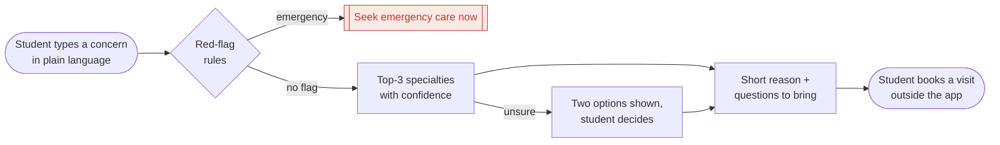

# Doc Compass

*Which doctor do I book?*

Describe a health concern in plain language. The app checks for emergency symptoms and suggests which kind of doctor to book (top 3, with "Start with a GP" always an option). It routes; it does not diagnose.

CMU 24-679 Project 1

## User flow



"Start with a GP" is always one of the options shown. Nothing the student types is stored.

## Set up

Needs Python 3.11 or newer.

```bash
python3 -m venv .venv && source .venv/bin/activate
pip install -r requirements.txt
python scripts/prepare_data.py     # downloads both datasets and builds the local files
python scripts/train_tfidf.py      # trains the from-scratch router on the public set
pytest                             # checks the rules, the scrub and the pipeline
```

## Run

```bash
python -m doccompass.app                    # the app, at http://127.0.0.1:7860
python tools/annotate.py --annotator NAME   # the labelling tool (NAME is sohum or akshara)
```

The labelling tool shows one post at a time and saves to `data/manual/NAME.labels.csv`. That file holds ids and labels only, so commit and push it when you stop. You can close the tool at any time; it resumes at your next unlabelled post.

## How it works

1. **Red-flag check**: written rules, each citing a published warning sign; emergencies go straight to "Seek emergency care now"
2. **Scrub**: simple rules remove handles, emails, phone numbers and links
3. **Route**: TF-IDF + logistic regression, and fine-tuned DistilRoBERTa vs BiomedBERT. When the router is unsure it shows two options instead of one
4. **Explain**: a short reason and questions to bring, from the routing result only

| Path | What it holds |
|---|---|
| `doccompass/` | the package: labels, data loading, rules, routers, pipeline, app |
| `scripts/` | data prep, pool selection, training |
| `tools/annotate.py` | the labelling tool |
| `tests/` | pytest checks |
| `docs/label-set.md` | the label set and the public-data mapping |
| `which-doctor-do-i-book.md` | the full plan |
| `docs/checkin/` | system figures |

## Data rules

- Never commit post text. Labelled data is shared as labels + MediQ ids only.
- Public and synthetic data are kept apart from our manual labels.
- Keep API keys and tokens out of the repo.
