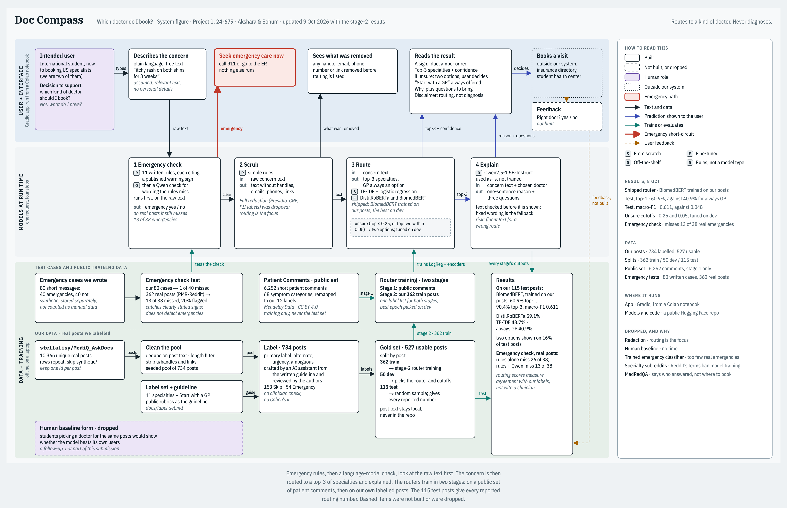

# Doc Compass: which doctor do I book?

Akshara N.S and Sohum Goel
CMU 24-679, Project 1
9 October 2026

---

## Executive Summary

In the US, patients often choose and book a specialist themselves, and a wrong choice costs a copay and weeks of waiting. Doc Compass is a self-help tool that reads a health concern in plain language and suggests which kind of doctor to book. It routes; it never diagnoses.

A request passes through an emergency check, a scrub of obvious identifiers, a router that returns the top three of eleven specialties or "Start with a GP", and a short explanation with questions to bring. We labelled 734 real patient posts, compared a router trained from scratch with two fine-tuned ones, and used an off-the-shelf language model for the explanation and a second emergency check.

On 115 of our own test posts the shipped router, BiomedBERT, picks the labelled doctor 60.9% of the time and has it in its top three 90.4% of the time. Always answering "Start with a GP" scores 40.9%. When the router is unsure, the app shows two options and lets the user decide. The emergency check is the weak point: on real posts it misses 13 of 38 emergencies, so it catches clearly stated warning signs and no more. The app runs from a Colab notebook.

---

## 1. Introduction and Motivation

**The task.** A person describes a health concern in their own words. Doc Compass answers one question: which kind of doctor should I book? It never answers "what do I have?".

**Why it matters.** We are both international students. In many home systems a family doctor decides where you go next. In the US the patient often picks, and specialties are split finely: podiatry or orthopedics, optometry or ophthalmology, dermatology or allergy.

**How we do it today.** Search the symptoms online, scan an insurance directory that lists specialties but not which one fits, ask friends, then guess. A wrong guess means a wasted copay, a new waitlist and sometimes a referral loop.

**What the tool is for.** Some specialists can only be reached through a GP. Doc Compass is still useful there: it tells you which destination your care path should lead to, so you can tell whether you are being sent the right way. "Start with a GP" is always offered.

**Success criteria**

| What success means | How we measure it | Result |
|---|---|---|
| Routes better than the obvious default | Top-1 accuracy on our own test posts, against always answering "Start with a GP" | 60.9% against 40.9%: met |
| The right door is on screen | The labelled doctor is in the top three | 90.4% |
| Never pretends to be sure | When unsure, show two options; count how often the shown answer is right | Two options on 16% of test posts; right on 83% of those and 86% of single answers |
| Never delays an emergency | Missed emergencies on real posts, target close to none | 13 of 38 missed: not met |
| Fast enough to use | Time per request | Routing takes about 80 ms per post; the full answer takes a few seconds |

---

## 2. Design Process

### 2.1 What mattered most

1. **Safety before routing.** The emergency check runs first and stops everything else. The cost: it also stops about 1 in 5 ordinary real posts.
2. **Honest uncertainty.** The app shows a top three, switches to two options when the router is unsure, and always offers a GP. The cost: a less decisive answer.
3. **A door, never a diagnosis.** The label is a kind of doctor, and the explanation is checked so it cannot name a condition.
4. **Privacy.** Nothing typed is stored, the language model runs inside the app, and post text never enters the repository.
5. **Evidence on real text.** Every reported routing number comes from our own test posts, not from public data.

### 2.2 The system

A concern enters at the top left. The emergency check reads the raw text; if it fires, the app shows "Seek emergency care now" and nothing else runs. Otherwise obvious identifiers are removed, the router returns its top three, and the language model writes a one-sentence reason and three questions. Below, the data lane shows the public set used for stage-1 training, our own labelled posts, and the test sets.

### 2.3 Data

| Dataset | Size | Used for |
|---|---|---|
| MediQ_AskDocs (real r/AskDocs posts) | 10,366 unique posts; we labelled 734 | Our own train, dev and test sets |
| Patient Comments and Specialist Types (public, CC BY 4.0) | 6,252 unique short comments | Stage-1 training only |
| PMR-Reddit test posts (real posts with clinician-derived urgency) | 362 posts, 38 emergencies | Testing the emergency check |
| Emergency cases we wrote | 80 short messages | Testing the emergency check |

**Collection and curation.** We removed duplicate posts, Reddit handles and links, kept posts of 25–400 words, and drew 734 with a fixed seed. The 190 test candidates are a plain random sample. Most train posts were picked so that each specialty has examples; 100 are random, and the dev posts come only from those.

**Labels.** Eleven specialties plus "Start with a GP", with an optional alternate, an urgency tier and an ambiguous flag. "Emergency" and "Skip" (not a which-doctor question) are used while labelling and kept out of the router. The labels were drafted by an AI assistant from a written guideline and reviewed by the authors.

| Split | Posts |
|---|---:|
| Train | 362 |
| Dev | 50 |
| Test | 115 |
| Emergency (tests the emergency check) | 54 |
| Skip | 153 |

**Augmentation.** None of our own posts is augmented. The public comments are mapped from 68 symptom categories to our 12 labels, with emoji and duplicates removed, and are stored apart from our data.

**Quality and limits.** Splits are by post, and no post is in two splits. There is no clinician check and no agreement score between two labellers, so the scores below measure agreement with our labels, not medical correctness.

**Ethics.** The posts are public but sensitive. We share only post ids and labels, never quote a post, and use made-up examples in the app.

### 2.4 Models

| Type | Model | Job |
|---|---|---|
| Trained from scratch | TF-IDF + logistic regression | Router |
| Fine-tuned | DistilRoBERTa and BiomedBERT, all weights | Router |
| Off-the-shelf | Qwen2.5-1.5B-Instruct, never trained | Explanation; second emergency check |

**Training.** Stage 1 trains each router on the public comments. Stage 2 trains on our 362 posts, either starting from the stage-1 model or from the original weights. The fine-tuned routers used 6 epochs, learning rate 2e-5, posts cut to 384 tokens and a loss weighted by class; the best epoch was chosen on dev. The from-scratch router uses word 1–2-grams and balanced class weights.

**Selection.** On dev we picked one version of each router by macro-F1, then shipped the best: BiomedBERT trained on our posts only. Public data alone transferred poorly (32–44% top-1 on dev), because the public comments are one line and our posts are paragraphs. The two "unsure" cutoffs were also tuned on dev. The test posts were used only for the final scores.

**Why Qwen.** It is small enough to run inside the app, so no text leaves it. We chose it for wording, not for decisions: the router chooses the doctor, and Qwen only explains.

**Result on our 115 test posts**

| Router | Top-1 (95% CI) | Top-3 | Macro-F1 |
|---|---|---|---|
| Always "Start with a GP" | 40.9% (31.8–50.4) | – | 0.048 |
| TF-IDF + logistic regression | 48.7% (39.3–58.2) | 84.3% | 0.428 |
| DistilRoBERTa | 59.1% (49.6–68.2) | 91.3% | 0.523 |
| **BiomedBERT (shipped)** | **60.9% (51.3–69.8)** | **90.4%** | **0.611** |

Both fine-tuned routers beat the baseline. The two are tied on top-1; BiomedBERT is ahead on macro-F1 but is also twice as deep, so this is not a like-for-like test of biomedical against general pretraining.

### 2.5 The emergency check

Eleven written rules, each quoting a published warning sign (MedlinePlus, CDC), run first. If none fires, Qwen is shown the full published list and asked whether the message describes any of those signs happening now.

| Tested on | Rules alone | Rules plus Qwen |
|---|---|---|
| 38 emergencies among 362 real posts | 26 missed | 13 missed; 20% of ordinary posts flagged |
| 40 emergencies among 80 cases we wrote | 25 missed | 1 missed |

Real emergencies depend on a clinical pattern more than on wording, and we found no open dataset large enough to train a classifier; the two we tried flagged a third to a half of ordinary posts. So the check catches clearly stated warning signs. It does not detect emergencies.

### 2.6 Interface

The app is built with Gradio, which gave us a working page in Python and a public link from a notebook. The result is drawn as a sign, like hospital wayfinding: blue for one answer, amber for two options, red for an emergency. Under it are the router's top three with confidence bars, the reason, and three questions worth answering before the visit.

---

## 3. User Experience and Workflow

1. **Describe the concern.** The user types a sentence or two, or picks a made-up example.
   *[Screenshot: the empty app with the text box and examples]*
2. **Emergency check.** If a warning sign is found, a red sign says "Seek emergency care now", with the reason and its source. Nothing else runs.
   *[Screenshot: the red sign for "sudden crushing chest pain"]*
3. **One clear answer.** A blue sign names the doctor to book and what that doctor covers.
   *[Screenshot: the blue sign for an itchy rash, Dermatology]*
4. **Two options.** When the router is unsure, an amber sign shows two doctors and the user decides. "Start with a GP" is always offered.
   *[Screenshot: the amber sign for "my gums bleed when I brush my teeth"]*
5. **Reason and questions.** One sentence links what the user wrote to what that doctor covers, followed by three questions to think about before the visit.
6. **Book the visit.** This happens outside the app.

| Situation | What the app does |
|---|---|
| Input too short | Asks for a sentence or two |
| Handles, emails, phone numbers or links in the text | Removes them and lists what was removed |
| The language model is missing or its text fails a check | Uses fixed wording; emergencies are checked by the rules only |
| The router cannot load | Suggests starting with a GP |

**How well it meets the objectives.** For a concern with a clear specialty the router is right most of the time: on test it got ENT 10 of 10, Orthopedics 8 of 9 and Dermatology 5 of 5. It is weak where the labelled answer is "Start with a GP" (15 of 47): it names a specialty for two thirds of those. The two-option sign and the standing GP offer soften that, but it is the main routing error.

---

## 4. Reflection and Next Steps

**Limits and risks**

- **Missed emergencies.** The check misses about a third of real emergencies. The app must not be read as triage.
- **Labels are not clinical truth.** They were drafted by an AI assistant and reviewed by us; neither is a clinician, and there is no agreement score.
- **Small test set.** 115 posts, and three labels have a single test post, so intervals are wide.
- **Fluent wrong answers.** When the router is wrong, the explanation still reads well.

**What went well.** Training first on public data gave us a working app before any labels existed, and showed exactly where public data breaks. Measuring the emergency check on real, clinician-labelled posts changed what we claim.

**What went poorly.** We trusted emergency cases we wrote ourselves (1 of 40 missed) until real posts showed 13 of 38 missed. Someone in the audience found a missed emergency during the presentation. Labelling started late, which is why the test set is small.

**How we used GenAI.** We used AI coding assistants (Claude Code, and Gemini for early brainstorming) to check the plan against the real datasets, write and debug code, draft the label set and labels, and draft the slides. They were fast and usually right about code, and confidently wrong about things they had not measured. Every correction came from running on real data or from one of us pushing back, so we adopted one rule: no number goes into a document unless a run produced it.

**Next steps, in order**

1. **Emergency data.** Get access to clinician-triaged emergency records and re-measure. This targets the one criterion we did not meet.
2. **Reviewed labels.** Have two people label the test posts independently and report agreement, with a clinician check on a sample. This turns "agreement with our labels" into evidence of correctness.
3. **More "Start with a GP" examples,** and re-tuned cutoffs, to cut the main routing error.
4. **A larger test set,** so every label has enough posts to score.
5. **A human baseline and permanent hosting.**

---

**Code and data:** github.com/akshara-ns/doc-compass · **Models:** huggingface.co/akshara-ns/doc-compass · **To run:** `notebooks/doc_compass_app.ipynb` in Google Colab

---

## To check before this becomes the PDF (delete this section)

- Add the four screenshots in section 3.
- Timing: "a few seconds" for a full answer was measured on a laptop with the stage-1 router (about 3 s for the explanation, about 1 s for the second emergency check). It was not timed on Colab.
- The "15 of 16 explanations passed" check is not quoted here because it was run with the stage-1 router.
- Every number is from `docs/routing-results.md`, `docs/emergency-check-results.md` or `docs/data-card.md`. The "always GP" top-3 is shown as a dash on purpose: that baseline gives one answer, so the 53.0% in the results doc is an artifact of label order.
- The executive summary must stay under 200 words.
